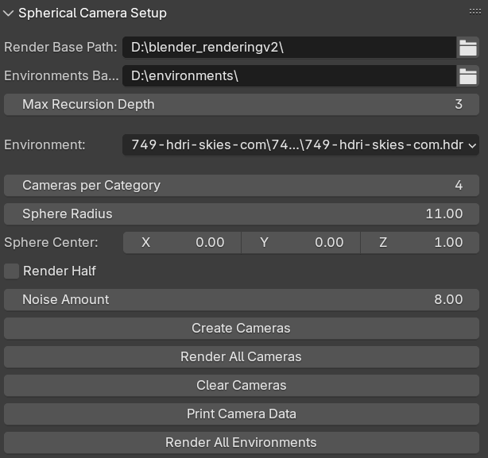
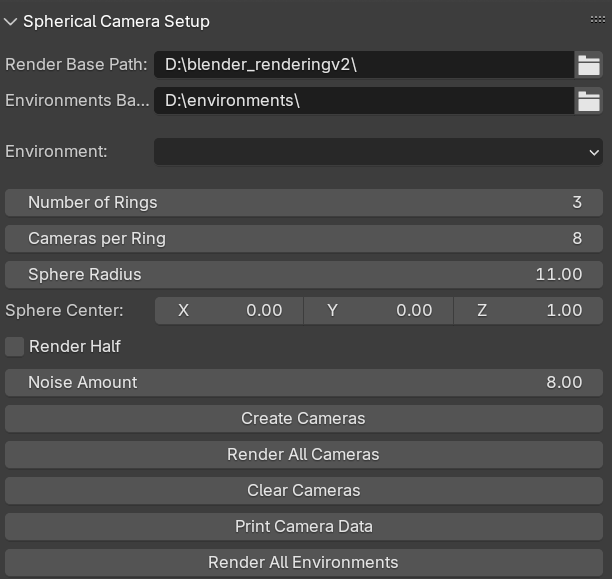

# 3D Model Generator Setup Notebook

This notebook guides you through setting up your environment for Nerfstudio, including installing Anaconda, CUDA, PyTorch, and the necessary projects.

> **Note:** Execute these commands inside a folder

> **Important:** This installation process follows the original Nerfstudio installation with one key difference—step **7** installs my fork of Nerfstudio. (Step **8** is used only for Gaussian Splatting.)

[NeRFStudio Installation](https://docs.nerf.studio/quickstart/installation.html)

---

## 1. Install Anaconda

Download Anaconda from [here](https://www.anaconda.com/download).

> **Note:** Follow the installation instructions on the website for your operating system.

---

## 2. Install CUDA

Download the latest version of CUDA from [here](https://developer.nvidia.com/cuda-downloads).

> **Tip:** Make sure your GPU is supported and check the release notes for any special installation instructions.

---

## 3. Create and Activate a New Anaconda Environment

Use a Code cell to create and activate your environment:

```bash
conda create -n nerfstudiotest python=3.11.10
conda activate nerfstudiotest
```
---

## 4. Install PyTorch
Install PyTorch with CUDA support using the following command:

```bash
pip3 install torch torchvision torchaudio --index-url https://download.pytorch.org/whl/cu124
```
---

## 5. Install CUDA Toolkit
Install the CUDA toolkit through Conda:
```bash
conda install -c "nvidia/label/cuda-12.4.1" cuda-toolkit
```
---

## 6. Install tinycuda
Install tinycuda using Git:
```bash
pip install git+https://github.com/NVlabs/tiny-cuda-nn/#subdirectory=bindings/torch
```
---

## !!!!! 7. Install My Nerfstudio Fork Implementation !!!!!
Clone the repository and install your fork:
```bash
git clone -b dev https://github.com/adrigia2/nerfstudioCameraScreen.git
cd nerfstudioCameraScreen
pip install --upgrade pip setuptools
pip install -e .
```
---

## 8. Install Gaussian Splatting
Install Gaussian Splatting:

```bash
pip install gsplat
```
OR
```bash
pip install git+https://github.com/nerfstudio-project/gsplat.git
```
For issues check [this](https://github.com/nerfstudio-project/nerfstudio/issues/2727) discussion

For additional installation details, please refer to the official documentation:

[NERF Studio Splat Documentation](https://docs.nerf.studio/nerfology/methods/splat.html)


# Hugging Face Models

This guide provides instructions on how to use Hugging Face models. Before getting started, ensure that all necessary dependencies are installed.

---

## Fine-Tuned Models

Access the fine-tuned models via the following repositories:

- **Tokenized Model:** [Hugging Face Tokenized Model Repository](https://huggingface.co/AdrianoC/RubberDuckProspectStableDiffusion_1_5_tokens)
- **Natural Model:** [Hugging Face Natural Model Repository](https://huggingface.co/AdrianoC/RubberDuckProspectStableDiffusion_1_5)

> **Note:** Manual cloning of these repositories is not required.

---

## Installation

Install the required dependencies with the following command:

```bash
pip install diffusers transformers accelerate scipy safetensors datasets
```

# Pipeline execution
To set up the pipeline, first install the required packages:
```bash
pip install selenium webdriver-manager
```

Then, run the pipeline with:

```bash
python pipeline.py
```

## Command-Line Arguments
The pipeline supports the following command-line arguments:

### `-i`, `--iterations`
- **Type:** `int`
- **Default:** `10`
- **Description:** Specifies the number of iterations to perform.

### `-m`, `--model`
- **Type:** `str`
- **Default:** `"instant-ngp"`
- **Description:** Specifies the NerfStudio model to use.

### `-s`, `--steps`
- **Type:** `int`
- **Default:** `3500`
- **Description:** Specifies the number of steps to execute.

### `-d`, `--not_tokenized`
- **Action:** `store_true`
- **Default:** `False`
- **Description:** When provided, indicates that the prompt is not tokenized.

# Blender Script

To execute the dataset generation scripts in Blender, follow these steps:

## 1. Open the Blender File
Open the `rubber duck blender.blend` file.  


## 2. Navigate to the Scripting Section
Switch to the Scripting tab.  


> **Note:** If you are looking for where to download HDR files, you can get them for free from [HDRI Skies Free HDRIs](https://hdri-skies.com/free-hdris/).


Select the script you wish to execute from the `BlenderScripts` folder.  
Two options:  
- **blenderScripting.py:** Allows you to specify the number of cameras per category.
- **blenderScriptingOld.py:** Allows you to choose cameras for a ring layout.

    ## blenderScripting.py

    

    ### Settings:
    - **Render base path:** Specifies where to save the rendering results.
    - **Environments base path:** Folder where HDR files are searched.
    - **Max Recursion Depth:** Determines how deeply to search for HDR files in the subfolders of the Environments base path.
    - **Environment:** Allows you to select and directly apply HDR files.
    - **Cameras per Category:** Specifies the number of cameras to place per category.
    - **Sphere radius:** Defines the distance of the cameras from the center.
    - **Sphere Center:** Sets the center of the sphere.
    - **Noise Amount:** Indicates how much noise to add during the creation of the cameras.

    ### Buttons:

    - **Create Camera:** Creates the cameras.
    - **Render All Cameras:** Begins the rendering process for the currently selected environment only.
    - **Clear Camera:** Deletes all created cameras.
    - **Print Camera Data:** Outputs logging information to the console.
    - **Render all environments:** Cycles through all found environments and renders them one at a time.

    ## blenderScriptingOld.py

    

    ### Settings:
    - **Render base path:** Specifies where to save the rendering results.
    - **Environments base path:** Folder where HDR files are searched.
    - **Environment:** Allows you to select and directly apply HDR files.
    - **Number of Rings:** Specifies the number of rings in the top hemisphere (note: the top camera and the first ring are implied).
    - **Cameras per Ring:** Specifies the number of cameras for each ring.
    - **Sphere radius:** Defines the distance of the cameras from the center.
    - **Sphere Center:** Sets the center of the sphere.
    - **Noise Amount:** Indicates how much noise to add during the creation of the cameras.

    ### Buttons:
    - **Create Camera:** Creates the cameras.
    - **Render All Cameras:** Begins the rendering process for the currently selected environment only.
    - **Clear Camera:** Deletes all created cameras.
    - **Print Camera Data:** Outputs logging information to the console.
    - **Render all environments:** Cycles through all found environments and renders them one at a time.


